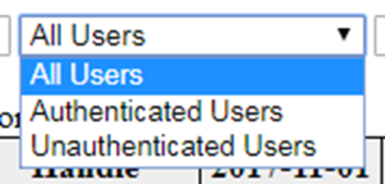

## Examining Your Repository under the Hood from the Solr Admin Console

Terry Brady

Georgetown University Library

https://github.com/terrywbrady/info


---
### SOLR in DSpace

- Search / Discovery
- OAI Harvest Index
- Statistics
- Authority Index (Optional)

+++

### Accessing SOLR

- In DSpace, SOLR Admin access is generally restricted to local server
- Overriding localhost restriction
  - Only for testing - be careful in production production
- https://github.com/DSpace/DSpace/blob/dspace-6_x/dspace-solr/src/main/webapp/WEB-INF/web.xml#L52-L56

+++

Comment out the following for testing

    <!-- Any path (name) registered in solrconfig.xml will be sent to that filter -->
    <filter>
      <filter-name>LocalHostRestrictionFilter</filter-name>
      <filter-class>org.dspace.solr.filters.LocalHostRestrictionFilter</filter-class>
    </filter>


---
### Tour of the Admin Console

- Caution - The Solr Admin Console has some options that are destructive
- Presentation will focus on safe operations

+++
### Core Selector


+++


+++
### Core Overview


+++


+++
### Core Query


+++


+++


+++
### Schema Browser


+++


+++


+++
### Document Add (for testing)


---

### Load Sample Statistics Data (if needed)

- [Sample Stats Records - 5 records](sample-data/statsSmall.csv)
- [Sample Stats Records - 5000 records](sample-data/stats.csv)
  - This data was pulled from a DSpace 5 test instance
  - Numeric identifiers for item/community/collection are instance specific
  - IP data has been masked
  - Remove the version column from the CSV file
- If possible, pull a sample from your own repository

---

### Query All Items

|name|value|
|---|---|
|q     | `*:*` |   

Note that Only 10 items are listed

+++

```
    "response": {
      "numFound": 5389,
      "start": 0,
      "docs": [
        ...
      ]
    }
```
@[2](total number of records in the statistics core)
@[3](starting position of the first document)
@[4-6](10 documents are returned as an array)  
+++

### Query All, View Only Item 1

|name|value|
|---|---|
|q     | `*:*` |   
|rows  | `1` |

+++

```
    "response": {
      "numFound": 5389,
      "start": 0,
      "docs": [
        {
          "ip": "0:0:0:0:0:0:0:1",
          "referrer": "http://localhost:9080/xmlui/",
          "dns": "localhost.",
          "userAgent": "Mozilla/5.0 (Windows NT 6.1; Win64; x64) AppleWebKit/537.36 (KHTML, like Gecko) Chrome/66.0.3359.139 Safari/537.36",
          "isBot": false,
          "time": "2018-05-03T14:22:58.686Z",
          "query": [
            "author_keyword:User,\\ Demo"
          ],
          "statistics_type": "search",
          "uid": "2e964339-52c1-4e4e-a872-c1fa929f47b7",
          "_version_": 1599479562937303000
        }
      ]
    }
```
@[3](The first item starts in position 0)
@[5-18](A single document returned)    
@[6-9](string values)
@[10](boolean true/false value)
@[11](date/time value)
@[12-14](array value)
@[15-16](string or uuid values)
@[17](long numeric value)


+++

### Query All, View Only Item 2

|name|value|
|---|---|
|q     | `*:*` |   
|start | `1` |
|rows  | `1` |

+++

```
    "response": {
      "numFound": 5389,
      "start": 1,
      "docs": [
        {
          "ip": "0:0:0:0:0:0:0:1",
          "referrer": "http://localhost:9080/xmlui/discover?filtertype=author&filter_relational_operator=equals&filter=User%2C+Demo",
          "dns": "localhost.",
          "userAgent": "Mozilla/5.0 (Windows NT 6.1; Win64; x64) AppleWebKit/537.36 (KHTML, like Gecko) Chrome/66.0.3359.139 Safari/537.36",
          "isBot": false,
          "id": "2d6e8422-9858-40bc-9507-5a195aadc6db",
          "type": 0,
          "owningItem": [
            "3084542e-d880-47ce-bfb5-50c19a1aff5b"
          ],
          "owningColl": [
            "24db41d0-51ae-472e-9f41-3319d8aaef2e"
          ],
          "owningComm": [
            "7c40107e-5bf2-48b0-82be-b36df7c1c415"
          ],
          "time": "2018-05-03T14:23:00.395Z",
          "bundleName": [
            "THUMBNAIL"
          ],
          "statistics_type": "view",
          "uid": "0f46bfbf-b7fc-4b2a-bbce-e47d339a3d5b",
          "_version_": 1599479565228441600
        }
      ]
    }
```

@[3](The second item starts in position 1)
@[12](This is a integer value.  Each class of DSpace objects has a numeric code.)

+++

### Change Output Format

- XML
- CSV
- JSON

+++

### XML Example
```
    <result name="response" numFound="5389" start="1">
      <doc>
        <str name="ip">0:0:0:0:0:0:0:1</str>
        <str name="referrer">http://localhost:9080/xmlui/discover?filtertype=author&filter_relational_operator=equals&filter=User%2C+Demo</str>
        <str name="dns">localhost.</str>
        <str name="userAgent">Mozilla/5.0 (Windows NT 6.1; Win64; x64) AppleWebKit/537.36 (KHTML, like Gecko) Chrome/66.0.3359.139 Safari/537.36</str>
        <bool name="isBot">false</bool>
        <str name="id">2d6e8422-9858-40bc-9507-5a195aadc6db</str>
        <int name="type">0</int>
        <arr name="owningItem">
          <str>3084542e-d880-47ce-bfb5-50c19a1aff5b</str>
        </arr>
        <arr name="owningColl">
          <str>24db41d0-51ae-472e-9f41-3319d8aaef2e</str>
        </arr>
        <arr name="owningComm">
          <str>7c40107e-5bf2-48b0-82be-b36df7c1c415</str>
        </arr>
        <date name="time">2018-05-03T14:23:00.395Z</date>
        <arr name="bundleName">
          <str>THUMBNAIL</str>
        </arr>
        <str name="statistics_type">view</str>
        <str name="uid">0f46bfbf-b7fc-4b2a-bbce-e47d339a3d5b</str>
        <long name="_version_">1599479565228441600</long></doc>
    </result
```    

@[1](Count and starting index are on the root element)
@[2-5](String values)
@[6](boolean value)
@[8](numeric value)   
@[9-17](array values)
@[18](date time value)

+++
### CSV Example

```
    continent,isBot,submitter,statistics_type,previousWorkflowStep,city,latitude,type,uid,owningItem,scopeType,countryCode,sortBy,id,owningComm,longitude,owner,scopeId,workflowItemId,ip,query,dns,workflowStep,userAgent,actor,referrer,rpp,_version_,sortOrder,bundleName,time,epersonid,owningColl
    "",false,,view,,,,0,0f46bfbf-b7fc-4b2a-bbce-e47d339a3d5b,3084542e-d880-47ce-bfb5-50c19a1aff5b,,,,2d6e8422-9858-40bc-9507-5a195aadc6db,7c40107e-5bf2-48b0-82be-b36df7c1c415,,,,,0:0:0:0:0:0:0:1,,localhost.,,"Mozilla/5.0 (Windows NT 6.1; Win64; x64) AppleWebKit/537.36 (KHTML, like Gecko) Chrome/66.0.3359.139 Safari/537.36",,http://localhost:9080/xmlui/discover?filtertype=author&filter_relational_operator=equals&filter=User%2C+Demo,,1599479565228441600,,THUMBNAIL,2018-05-03T14:23:00.395Z,,24db41d0-51ae-472e-9f41-3319d8aaef2e

```
@[1](CSV headers)
@[2](csv row of data)
+++

### List specific fields

|name|value|
|---|---|
|q     | `*:*` |   
|start | `1` |
|rows  | `1` |
|fl    | `statistics_type, type, time` |

+++

```
    "response": {
       "numFound": 5290,
       "start": 1,
       "docs": [
         {
           "type": 4,
           "time": "2016-01-03T13:33:09.945Z",
           "statistics_type": "view"
         }
       ]
     }
```
@[5-9](A much more readable return object)
+++

### List 20 items

|name|value|
|---|---|
|q     | `*:*` |   
|start | `0` |
|rows  | `20` |
|fl    | `statistics_type, type, time` |

+++

```
"response": {
    "numFound": 5290,
    "start": 0,
    "docs": [
      {
        "type": 0,
        "time": "2015-01-03T13:32:32.506Z",
        "statistics_type": "view"
      },
      {
        "type": 4,
        "time": "2016-01-03T13:33:09.945Z",
        "statistics_type": "view"
      },
      {
        "type": 0,
        "time": "2017-01-03T13:33:12.771Z",
        "statistics_type": "view"
      },
      {
        "type": 0,
        "time": "2018-01-03T13:33:12.804Z",
        "statistics_type": "view"
      },
      ...
  ]
}
```
@[5-9](Doc 1 -- with type 0 - bitstream)
@[10-14](Doc 2 -- with type 4 - community)
@[8](All have statistics_type = "view")
@[8](We'll discover other values)

---

### Analyze Fields (Schema Browser)

- statistics_type
- type    

+++


+++


+++


+++


+++


+++

### Analyze statistics_type (By Facet)

|name|value|
|---|---|
|q          | `*:*` |   
|start      | `0` |
|rows       | `0` |
|facet      | `true` |
|facet.field| `statistics_type` |

+++
```
"response": {
    "numFound": 5290,
    "start": 0,
    "docs": []
  },
  "facet_counts": {
    "facet_queries": {},
    "facet_fields": {
      "statistics_type": [
        "view",
        5202,
        "search",
        74,
        "workflow",
        14,
        "Mozilla/5.0 (Windows NT 6.1; Win64; x64) AppleWebKit/537.36 (KHTML, like Gecko) Chrome/64.0.3282.186 Safari/537.36",
        0
      ]
    },
    "facet_dates": {},
    "facet_ranges": {},
    "facet_intervals": {}
  }
```
@[3](5290 records found)
@[4](We requested no documents)
@[5](facet counts are being returned)
@[7-18](facet value/counts are returned in descending frequency)
@[8-9](views)
@[10-11](searches)
@[12-13](workflow tasks)
+++

### Type in DSpace
|Num|Object|
|---|------|
|0  |Bitstream|
|1  |Bundle (of Bitstreams)|
|2  |Item|
|3  |Collection|
|4  |Community|
|5  |Repository|

+++

### Analyze type (By Facet)

|name|value|
|---|---|
|q          | `*:*` |   
|start      | `0` |
|rows       | `0` |
|facet      | `true` |
|facet.field| `type` |

+++

```
"response": {
    "numFound": 5290,
    "start": 0,
    "docs": []
  },
  "facet_counts": {
    "facet_queries": {},
    "facet_fields": {
      "type": [
        "0",
        2548,
        "3",
        2099,
        "4",
        341,
        "2",
        206,
        "5",
        22
      ]
    },
    "facet_dates": {},
    "facet_ranges": {},
    "facet_intervals": {}
  }

```
@[3](5290 records found)
@[4](We requested no documents)
@[9-21](type field values returned in descending order of frequency)
@[10-11](0 - bitstream actions)
@[12-13](3 - collection actions)
@[14-15](4 - community actions)
@[16-17](2 - item actions)
@[18-19](5 - repository actions)
+++

### Analyze time (By Facet)

|name|value|
|---|---|
|q          | `*:*` |   
|start      | `0` |
|rows       | `0` |
|facet      | `true` |
|facet.field| `time` |

+++

```
"facet_counts": {
    "facet_queries": {},
    "facet_fields": {
      "time": [
        "2018-02-26T15:23:21.105Z",
        3,
        "2018-02-26T15:23:22.304Z",
        3,
        "2018-02-26T15:23:24.534Z",
        3,
        "2018-02-26T16:00:57.788Z",
        3,
        ...
    ]
  }
}
```
@[4-12](each millisecond has its own entry... this is not very useful)
---

### Adding a Date Facet

- Use the Raw Query Parameters Field for search parameters that do not appear on the form
- Urlencode special characters
- In the following example `+` becomes `%2B`

+++

### Analyze year (By DATE Facet)

|name|value|
|---|---|
|q          | `*:*` |   
|start      | `0` |
|rows       | `0` |
|facet      | `true` |
|Raw Query Parameters|See following slides|

+++

### Last 5 Years (Raw Query Params)

|name|value|
|---|---|
|facet.date|time|
|facet.date.start|NOW/YEAR/DAY-5YEARS|
|facet.date.end|NOW/YEAR/DAY+1YEAR|
|facet.date.gap|+1YEAR|

    &facet.date=time&facet.date.start=NOW/YEAR/DAY-5YEARS&facet.date.end=NOW/YEAR/DAY%2B1YEAR&facet.date.gap=%2B1YEAR

+++
```
"facet_counts": {
    "facet_queries": {},
    "facet_fields": {},
    "facet_dates": {
      "time": {
        "2013-01-01T00:00:00Z": 0,
        "2014-01-01T00:00:00Z": 0,
        "2015-01-01T00:00:00Z": 1,
        "2016-01-01T00:00:00Z": 1,
        "2017-01-01T00:00:00Z": 1,
        "2018-01-01T00:00:00Z": 5287,
        "gap": "+1YEAR",
        "start": "2013-01-01T00:00:00Z",
        "end": "2019-01-01T00:00:00Z"
      }
    },
    "facet_ranges": {},
    "facet_intervals": {}
  }

```
@[12-14](query details interpreted)
@[6-11](counts by year... I forced some records to past years)
+++

### Last 12 Months (Raw Query Params)

|name|value|
|---|---|
|facet.date|time|
|facet.date.start|NOW/MONTH/DAY-12MONTHS|
|facet.date.end|NOW/MONTH/DAY+1MONTH|
|facet.date.gap|+1MONTH|

    &facet.date=time&facet.date.start=NOW/MONTH/DAY-12MONTHS&facet.date.end=NOW/MONTH/DAY%2B1MONTH&facet.date.gap=%2B1MONTH

+++
```
"facet_counts": {
    "facet_queries": {},
    "facet_fields": {},
    "facet_dates": {
      "time": {
        "2017-05-01T00:00:00Z": 0,
        "2017-06-01T00:00:00Z": 0,
        "2017-07-01T00:00:00Z": 0,
        "2017-08-01T00:00:00Z": 0,
        "2017-09-01T00:00:00Z": 0,
        "2017-10-01T00:00:00Z": 0,
        "2017-11-01T00:00:00Z": 0,
        "2017-12-01T00:00:00Z": 0,
        "2018-01-01T00:00:00Z": 109,
        "2018-02-01T00:00:00Z": 2882,
        "2018-03-01T00:00:00Z": 2129,
        "2018-04-01T00:00:00Z": 92,
        "2018-05-01T00:00:00Z": 75,
        "gap": "+1MONTH",
        "start": "2017-05-01T00:00:00Z",
        "end": "2018-06-01T00:00:00Z"
      }
    },
    "facet_ranges": {},
    "facet_intervals": {}
  }
}
```
@[6-17](counts for the last 12 months)
+++

### Last 6 Quarters (Raw Query Params)

|name|value|
|---|---|
|facet.date|time|
|facet.date.start|NOW/MONTH/DAY-18MONTHS|
|facet.date.end|NOW/MONTH/DAY+3MONTHS|
|facet.date.gap|+3MONTHS|

    &facet.date=time&facet.date.start=NOW/MONTH/DAY-18MONTHS&facet.date.end=NOW/MONTH/DAY%2B3MONTHS&facet.date.gap=%2B3MONTHS

+++
```
"facet_counts": {
    "facet_queries": {},
    "facet_fields": {},
    "facet_dates": {
      "time": {
        "2016-11-01T00:00:00Z": 1,
        "2017-02-01T00:00:00Z": 0,
        "2017-05-01T00:00:00Z": 0,
        "2017-08-01T00:00:00Z": 0,
        "2017-11-01T00:00:00Z": 109,
        "2018-02-01T00:00:00Z": 5103,
        "2018-05-01T00:00:00Z": 75,
        "gap": "+3MONTHS",
        "start": "2016-11-01T00:00:00Z",
        "end": "2018-08-01T00:00:00Z"
      }
    },
    "facet_ranges": {},
    "facet_intervals": {}
  }
}  
```
@[6-12](counts for the last 18 months by quarter)

+++

### Last 7 Days (Raw Query Params)

|name|value|
|---|---|
|facet.date|time|
|facet.date.start|NOW/DAY-7DAYS|
|facet.date.end|NOW/DAY+1DAY|
|facet.date.gap|+1DAY|

    &facet.date=time&facet.date.start=NOW/DAY-7DAYS&facet.date.end=NOW/DAY%2B1DAY&facet.date.gap=%2B1DAY
+++
```
"facet_counts": {
  "facet_queries": {},
  "facet_fields": {},
  "facet_dates": {
    "time": {
      "2018-05-20T00:00:00Z": 0,
      "2018-05-21T00:00:00Z": 0,
      "2018-05-22T00:00:00Z": 0,
      "2018-05-23T00:00:00Z": 0,
      "2018-05-24T00:00:00Z": 0,
      "2018-05-25T00:00:00Z": 0,
      "2018-05-26T00:00:00Z": 0,
      "2018-05-27T00:00:00Z": 0,
      "gap": "+1DAY",
      "start": "2018-05-20T00:00:00Z",
      "end": "2018-05-28T00:00:00Z"
    }
  },
  "facet_ranges": {},
  "facet_intervals": {}
}
```
@[6-13](counts for the last week by day)
---

### Combining Search with a Date Facet

|name|value|
|---|---|
|q          | `statistics_type:search` |   
|start      | `0` |
|rows       | `0` |
|facet      | `true` |

    &facet.date=time&facet.date.start=NOW/MONTH/DAY-12MONTHS&facet.date.end=NOW/MONTH/DAY%2B1MONTH&facet.date.gap=%2B1MONTH

+++
```
"response": {
  "numFound": 74,
  "start": 0,
  "docs": []
},
"facet_counts": {
  "facet_queries": {},
  "facet_fields": {},
  "facet_dates": {
    "time": {
      "2017-05-01T00:00:00Z": 0,
      "2017-06-01T00:00:00Z": 0,
      "2017-07-01T00:00:00Z": 0,
      "2017-08-01T00:00:00Z": 0,
      "2017-09-01T00:00:00Z": 0,
      "2017-10-01T00:00:00Z": 0,
      "2017-11-01T00:00:00Z": 0,
      "2017-12-01T00:00:00Z": 0,
      "2018-01-01T00:00:00Z": 1,
      "2018-02-01T00:00:00Z": 39,
      "2018-03-01T00:00:00Z": 29,
      "2018-04-01T00:00:00Z": 2,
      "2018-05-01T00:00:00Z": 3,
      "gap": "+1MONTH",
      "start": "2017-05-01T00:00:00Z",
      "end": "2018-06-01T00:00:00Z"
    }
  },
  "facet_ranges": {},
  "facet_intervals": {}
}

```
@[2](Notice that our query limited the set of docs to facet)
@[11-22](Note that the counts are much smaller)
+++
### Combining Search with a Date Facet

|name|value|
|---|---|
|q          | `statistics_type:view` |   
|start      | `0` |
|rows       | `0` |
|facet      | `true` |

    &facet.date=time&facet.date.start=NOW/MONTH/DAY-12MONTHS&facet.date.end=NOW/MONTH/DAY%2B1MONTH&facet.date.gap=%2B1MONTH

+++
```
"response": {
    "numFound": 5202,
    "start": 0,
    "docs": []
  },
  "facet_counts": {
    "facet_queries": {},
    "facet_fields": {},
    "facet_dates": {
      "time": {
        "2017-05-01T00:00:00Z": 0,
        "2017-06-01T00:00:00Z": 0,
        "2017-07-01T00:00:00Z": 0,
        "2017-08-01T00:00:00Z": 0,
        "2017-09-01T00:00:00Z": 0,
        "2017-10-01T00:00:00Z": 0,
        "2017-11-01T00:00:00Z": 0,
        "2017-12-01T00:00:00Z": 0,
        "2018-01-01T00:00:00Z": 107,
        "2018-02-01T00:00:00Z": 2837,
        "2018-03-01T00:00:00Z": 2097,
        "2018-04-01T00:00:00Z": 88,
        "2018-05-01T00:00:00Z": 70,
        "gap": "+1MONTH",
        "start": "2017-05-01T00:00:00Z",
        "end": "2018-06-01T00:00:00Z"
      }
    },
    "facet_ranges": {},
    "facet_intervals": {}
  }
```
+++

### Complex Queries - NOT Syntax

|name|value|
|---|---|
|q | `NOT(statistics_type:*)` |   
|rows|1|

+++
```
"response": {
    "numFound": 0,
    "start": 0,
    "docs": []
  },
}
```
@[2](No results - all items have a statistics_type)
+++

### Complex Queries - NOT Syntax

|name|value|
|---|---|
|q | `NOT(type:*)` |  
|rows|1|

+++
```
"response": {
    "numFound": 74,
    "start": 0,
    "docs": [
      {
        "statistics_type": "search"
      }
     ]
    }
}
```
+++

### Complex Queries - AND Clause

|name|value|
|---|---|
|q | `NOT(type:*) AND scopeType:3` |   

+++
```
"response": {
   "numFound": 15,
   "start": 0,
   "docs": [
     {
       "uid": "9f59935a-ecb0-47ec-aa52-0977355259bc",
       "userAgent": "Mozilla/5.0 (Windows NT 6.1; Win64; x64) AppleWebKit/537.36 (KHTML, like Gecko) Chrome/63.0.3239.132 Safari/537.36",
       "query": [
         "catalog"
       ],
       "isBot": false,
       "time": "2018-02-23T17:41:46.933Z",
       "scopeType": 3,
       "scopeId": 141,
       "epersonid": 0,
       "dns": "11.222.444.87",
       "statistics_type": "search",
       "ip": "11.222.444.87",
       "referrer": "https://myrepo.myinst.edu/handle/987654321/549449",
       "_version_": 1601579717295603700
     }
   ]
 }

```
@[2](A smaller count - this query is looking for searches run in a specific DSpace collection)
+++

### Complex Queries - RANGE Query

|name|value|
|---|---|
|q | `NOT(type:*) AND scopeType:[3 TO 4]` |   

+++
```
"response": {
  "numFound": 27,
  "start": 0,
  "docs": []
}

```
+++

### Complex Queries - DATE RANGE QUERY

|name|value|
|---|---|
|q | `NOT(type:*) AND time:[NOW-7MONTHS TO NOW]` |   

+++
```
response": {
    "numFound": 74,
    "start": 0,
    "docs": []
  }
```
---

### Our Custom Solr App

- DigitalGeorgetown
  - DSpace has collected 31 million records over the past 7 years
    - With simple bot filtering: 22 million
  - Stats Queries are relatively fast considering the volume

+++

### Sample Application Built With Solr Queries

- Statistics Reporting Tool
  - PHP Application for Repository Admins
  - Supplements statistics reports in DSpace
  - Additional bot filtering via Solr queries

+++  
### Demo: DigitalGeorgetown Statistics Reporting Tool   

+++


+++


+++


+++


+++


+++?code=https://raw.githubusercontent.com/Georgetown-University-Libraries/batch-tools/master/web/stats/solrFacets.php&lang=php
@[16-20](Date Query Construction)
@[21-25](Date Query Construction)
@[44-55](Queries based on DSpace Hierarchical Levels)
@[64-71](Distinguishing Downloads from Thumbnail Views)
@[72-83](Distinguishing full text and faceted searches)

---
### Working with a different Solr Repository

Each DSpace instance contains at least 3-4 separate Solr instances.  

The presentation will take a brief tour of the DSpace "search" repository illustrating how the lessons learned from the statistics repository could be applied to a Solr repository with a different schema.
+++

#### Sample Data Collection

+++


+++

#### Sample Item with Image Bitstream - Summary View

+++


+++

#### Sample Item with Image Bitstream - Full View

+++


+++

#### Sample Item with Fulltext Bitstream - Summary View

+++


+++

#### Sample Item with Fulltext Bitstream - Full View

+++


+++

#### Sample Item with Fulltext Bitstream - Bitstream View

+++


+++

#### Solr Field Analysis - Discovery View

+++


+++


+++


+++


+++


+++


### What Can We Learn?

- Field called "handle"
- Field called "fulltext"
- Field called "location.coll"

+++

### Search for our handle

|name|value|
|---|---|
|q | `handle:123456789/27` |   

+++

### View the results, note that there is a field called "title"

+++

### Search for our handle

|name|value|
|---|---|
|q | `handle:123456789/27` |   
|fl | `handle,title,location.coll,fulltext` |   

+++


+++
```
"docs": [
  {
    "handle": "123456789/27",
    "location.coll": [
      "71cf5a49-4607-4cfe-b395-1ea2d6e6af87"
    ],
    "title": [
      "Sample item with image bitstream"
    ]
  }
]
```

+++

### Search by location.coll

|name|value|
|---|---|
|q | `location.coll:71cf5a49-4607-4cfe-b395-1ea2d6e6af87` |   
|fl | `handle,title` |   

+++


+++
```
"docs": [
  {
    "handle": "123456789/28",
    "title": [
      "Sample item with fulltext bitstream"
    ]
  },
  {
    "handle": "123456789/27",
    "title": [
      "Sample item with image bitstream"
    ]
  }
]
```
+++

### Search by location.coll and fulltext

|name|value|
|---|---|
|q | `location.coll:71cf5a49-4607-4cfe-b395-1ea2d6e6af87 AND fulltext:*` |   
|fl | `handle,title` |   

+++


+++
```
"docs": [
   {
     "handle": "123456789/28",
     "title": [
       "Sample item with fulltext bitstream"
     ]
   }
 ]
```
---
### Summary

- Try out the Solr Admin Console to learn more about your Repository and applications

---
### Thank You

Terry Brady

Georgetown University Library

https://github.com/terrywbrady/info


