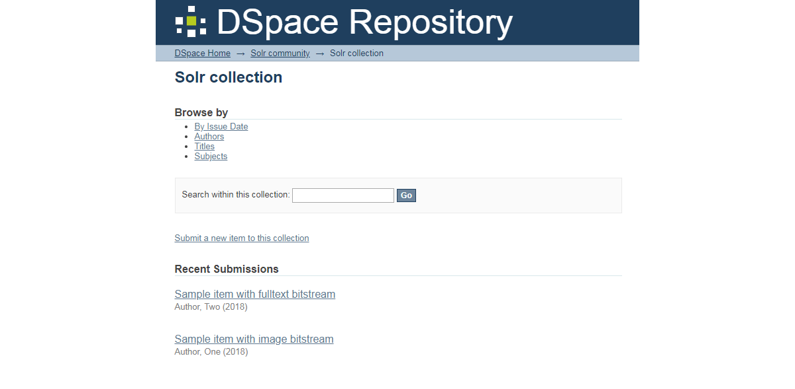
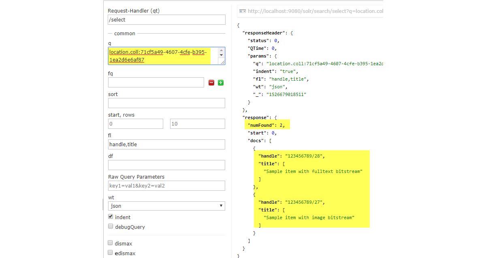

## Examining Your Repository under the Hood from the Solr Admin Console

Terry Brady

Georgetown University Library

https://github.com/terrywbrady/info

---
### SOLR in DSpace

- Search / Discovery
- OAI Harvest Index
- Statistics 
- Authority Index (Optional)

+++

### Accessing SOLR

- In DSpace, SOLR Admin access is generally restricted to local server
- Overriding localhost restriction
  - Only for testing - be careful in production production
- https://github.com/DSpace/DSpace/blob/dspace-6_x/dspace-solr/src/main/webapp/WEB-INF/web.xml#L52-L56

+++

Comment out the following for testing

    <!-- Any path (name) registered in solrconfig.xml will be sent to that filter -->
    <filter>
      <filter-name>LocalHostRestrictionFilter</filter-name>
      <filter-class>org.dspace.solr.filters.LocalHostRestrictionFilter</filter-class>
    </filter>

---
### Tour of the Admin Console

- Caution - The Solr Admin Console has some options that are destructive
- Presentation will focus on safe operations

+++
### Core Selector

+++
### Core Overview 

+++
### Core Query

+++
### Schema Browser

+++
### Document Add (for testing)

---

### Load Sample Statistics Data (if needed)

- [Sample Stats Records - 5 records](sample-data/statsSmall.csv)
- [Sample Stats Records - 5000 records](sample-data/stats.csv)
  - This data was pulled from a DSpace 5 test instance
  - Numeric identifiers for item/community/collection are instance specific
  - IP data has been masked
  - Remove the version column from the CSV file
- If possible, pull a sample from your own repository

---

### Query All Items

|name|value|
|---|---|
|q     | `*:*` |   

Note that Only 10 items are listed

+++

    "response": {
      "numFound": 5389,
      "start": 0,
      "docs": [
        ...
      ]
    }
+++

### Query All, View Only Item 1

|name|value|
|---|---|
|q     | `*:*` |   
|rows  | `1` |

+++

    "response": {
      "numFound": 5389,
      "start": 0,
      "docs": [
        {
          "ip": "0:0:0:0:0:0:0:1",
          "referrer": "http://localhost:9080/xmlui/",
          "dns": "localhost.",
          "userAgent": "Mozilla/5.0 (Windows NT 6.1; Win64; x64) AppleWebKit/537.36 (KHTML, like Gecko) Chrome/66.0.3359.139 Safari/537.36",
          "isBot": false,
          "time": "2018-05-03T14:22:58.686Z",
          "query": [
            "author_keyword:User,\\ Demo"
          ],
          "statistics_type": "search",
          "uid": "2e964339-52c1-4e4e-a872-c1fa929f47b7",
          "_version_": 1599479562937303000
        }
      ]
    }
+++

### Query All, View Only Item 2

|name|value|
|---|---|
|q     | `*:*` |   
|start | `1` |
|rows  | `1` |

+++

    "response": {
      "numFound": 5389,
      "start": 1,
      "docs": [
        {
          "ip": "0:0:0:0:0:0:0:1",
          "referrer": "http://localhost:9080/xmlui/discover?filtertype=author&filter_relational_operator=equals&filter=User%2C+Demo",
          "dns": "localhost.",
          "userAgent": "Mozilla/5.0 (Windows NT 6.1; Win64; x64) AppleWebKit/537.36 (KHTML, like Gecko) Chrome/66.0.3359.139 Safari/537.36",
          "isBot": false,
          "id": "2d6e8422-9858-40bc-9507-5a195aadc6db",
          "type": 0,
          "owningItem": [
            "3084542e-d880-47ce-bfb5-50c19a1aff5b"
          ],
          "owningColl": [
            "24db41d0-51ae-472e-9f41-3319d8aaef2e"
          ],
          "owningComm": [
            "7c40107e-5bf2-48b0-82be-b36df7c1c415"
          ],
          "time": "2018-05-03T14:23:00.395Z",
          "bundleName": [
            "THUMBNAIL"
          ],
          "statistics_type": "view",
          "uid": "0f46bfbf-b7fc-4b2a-bbce-e47d339a3d5b",
          "_version_": 1599479565228441600
        }
      ]
    }
+++

### Change Output Format

- XML
- CSV
- JSON

+++

    <result name="response" numFound="5389" start="1">
      <doc>
        <str name="ip">0:0:0:0:0:0:0:1</str>
        <str name="referrer">http://localhost:9080/xmlui/discover?filtertype=author&filter_relational_operator=equals&filter=User%2C+Demo</str>
        <str name="dns">localhost.</str>
        <str name="userAgent">Mozilla/5.0 (Windows NT 6.1; Win64; x64) AppleWebKit/537.36 (KHTML, like Gecko) Chrome/66.0.3359.139 Safari/537.36</str>
        <bool name="isBot">false</bool>
        <str name="id">2d6e8422-9858-40bc-9507-5a195aadc6db</str>
        <int name="type">0</int>
        <arr name="owningItem">
          <str>3084542e-d880-47ce-bfb5-50c19a1aff5b</str>
        </arr>
        <arr name="owningColl">
          <str>24db41d0-51ae-472e-9f41-3319d8aaef2e</str>
        </arr>
        <arr name="owningComm">
          <str>7c40107e-5bf2-48b0-82be-b36df7c1c415</str>
        </arr>
        <date name="time">2018-05-03T14:23:00.395Z</date>
        <arr name="bundleName">
          <str>THUMBNAIL</str>
        </arr>
        <str name="statistics_type">view</str>
        <str name="uid">0f46bfbf-b7fc-4b2a-bbce-e47d339a3d5b</str>
        <long name="_version_">1599479565228441600</long></doc>
    </result>
+++

    continent,isBot,submitter,statistics_type,previousWorkflowStep,city,latitude,type,uid,owningItem,scopeType,countryCode,sortBy,id,owningComm,longitude,owner,scopeId,workflowItemId,ip,query,dns,workflowStep,userAgent,actor,referrer,rpp,_version_,sortOrder,bundleName,time,epersonid,owningColl
    "",false,,view,,,,0,0f46bfbf-b7fc-4b2a-bbce-e47d339a3d5b,3084542e-d880-47ce-bfb5-50c19a1aff5b,,,,2d6e8422-9858-40bc-9507-5a195aadc6db,7c40107e-5bf2-48b0-82be-b36df7c1c415,,,,,0:0:0:0:0:0:0:1,,localhost.,,"Mozilla/5.0 (Windows NT 6.1; Win64; x64) AppleWebKit/537.36 (KHTML, like Gecko) Chrome/66.0.3359.139 Safari/537.36",,http://localhost:9080/xmlui/discover?filtertype=author&filter_relational_operator=equals&filter=User%2C+Demo,,1599479565228441600,,THUMBNAIL,2018-05-03T14:23:00.395Z,,24db41d0-51ae-472e-9f41-3319d8aaef2e
    
+++

### List specific fields

|name|value|
|---|---|
|q     | `*:*` |   
|start | `1` |
|rows  | `1` |
|fl    | `statistics_type, type, time` |

+++

### List 20 items

|name|value|
|---|---|
|q     | `*:*` |   
|start | `0` |
|rows  | `20` |
|fl    | `statistics_type, type, time` |
    
---

### Analyze Fields (Schema Browser)

- statistics_type
- type    
    
+++

### Analyze statistics_type (By Facet)

|name|value|
|---|---|
|q          | `*:*` |   
|start      | `0` |
|rows       | `0` |
|facet      | `true` |
|facet.field| `statistics_type` |

+++

### Analyze type (By Facet)

|name|value|
|---|---|
|q          | `*:*` |   
|start      | `0` |
|rows       | `0` |
|facet      | `true` |
|facet.field| `type` |

+++

### Analyze time (By Facet)

|name|value|
|---|---|
|q          | `*:*` |   
|start      | `0` |
|rows       | `0` |
|facet      | `true` |
|facet.field| `time` |

---

### Adding a Date Facet

- Use the Raw Query Parameters Field for search parameters that do not appear on the form
- Urlencode special characters
- In the following example `+` becomes `%2B`

+++

### Analyze year (By DATE Facet)

|name|value|
|---|---|
|q          | `*:*` |   
|start      | `0` |
|rows       | `0` |
|facet      | `true` |
|Raw Query Parameters|See following slides|

+++

### Last 5 Years (Raw Query Params)

|name|value|
|---|---|
|facet.date|time|
|facet.date.start|NOW/YEAR/DAY-5YEARS|
|facet.date.end|NOW/YEAR/DAY+1YEAR|
|facet.date.gap|+1YEAR|

    &facet.date=time&facet.date.start=NOW/YEAR/DAY-5YEARS&facet.date.end=NOW/YEAR/DAY%2B1YEAR&facet.date.gap=%2B1YEAR

+++

### Last 12 Months (Raw Query Params)

|name|value|
|---|---|
|facet.date|time|
|facet.date.start|NOW/MONTH/DAY-12MONTHS|
|facet.date.end|NOW/MONTH/DAY+1MONTH|
|facet.date.gap|+1MONTH|

    &facet.date=time&facet.date.start=NOW/MONTH/DAY-12MONTHS&facet.date.end=NOW/MONTH/DAY%2B1MONTH&facet.date.gap=%2B1MONTH

+++

### Last 6 Quarters (Raw Query Params)

|name|value|
|---|---|
|facet.date|time|
|facet.date.start|NOW/MONTH/DAY-18MONTHS|
|facet.date.end|NOW/MONTH/DAY+3MONTHS|
|facet.date.gap|+3MONTHS|

    &facet.date=time&facet.date.start=NOW/MONTH/DAY-18MONTHS&facet.date.end=NOW/MONTH/DAY%2B3MONTHS&facet.date.gap=%2B3MONTHS

+++

### Last 7 Days (Raw Query Params)

|name|value|
|---|---|
|facet.date|time|
|facet.date.start|NOW/DAY-7DAYS|
|facet.date.end|NOW/DAY+1DAY|
|facet.date.gap|+1DAY|

    &facet.date=time&facet.date.start=NOW/DAY-7DAYS&facet.date.end=NOW/DAY%2B1DAY&facet.date.gap=%2B1DAY

---

### Combining Search with a Date Facet

|name|value|
|---|---|
|q          | `statistics_type:search` |   
|start      | `0` |
|rows       | `0` |
|facet      | `true` |

    &facet.date=time&facet.date.start=NOW/MONTH/DAY-12MONTHS&facet.date.end=NOW/MONTH/DAY%2B1MONTH&facet.date.gap=%2B1MONTH

+++

### Combining Search with a Date Facet

|name|value|
|---|---|
|q          | `statistics_type:view` |   
|start      | `0` |
|rows       | `0` |
|facet      | `true` |

    &facet.date=time&facet.date.start=NOW/MONTH/DAY-12MONTHS&facet.date.end=NOW/MONTH/DAY%2B1MONTH&facet.date.gap=%2B1MONTH

+++

### Complex Queries - NOT Syntax

|name|value|
|---|---|
|q | `NOT(statistics_type:*)` |   

+++

### Complex Queries - NOT Syntax

|name|value|
|---|---|
|q | `NOT(type:*)` |   

+++

### Complex Queries - AND Clause

|name|value|
|---|---|
|q | `NOT(type:*) AND scopeType:3` |   

+++

### Complex Queries - RANGE Query

|name|value|
|---|---|
|q | `NOT(type:*) AND scopeType:[3 TO 4]` |   

+++

### Complex Queries - DATE RANGE QUERY

|name|value|
|---|---|
|q | `NOT(type:*) AND time:[NOW-7MONTHS TO NOW]` |   

---

### Our Custom Solr App

- DigitalGeorgetown
  - DSpace has collected 31 million records over the past 7 years
    - With simple bot filtering: 22 million
  - Stats Queries are relatively fast considering the volume

+++

### Sample Application Built With Solr Queries

- Statistics Reporting Tool
  - PHP Application for Repository Admins
  - Supplements statistics reports in DSpace
  - Additional bot filtering via Solr queries
  
+++  
### Demo: DigitalGeorgetown Statistics Reporting Tool   

+++?code=https://raw.githubusercontent.com/Georgetown-University-Libraries/batch-tools/master/web/stats/solrFacets.php&lang=php
@[16-20](Date Query Construction)
@[21-25](Date Query Construction)
@[44-55](Queries based on DSpace Hierarchical Levels)
@[64-71](Distinguishing Downloads from Thumbnail Views)
@[72-83](Distinguishing full text and faceted searches)

---
### Working with a different Solr Repository

Each DSpace instance contains at least 3-4 separate Solr instances.  

The presentation will take a brief tour of the DSpace "search" repository illustrating how the lessons learned from the statistics repository could be applied to a Solr repository with a different schema.
+++

#### Sample Data Collection

+++

+++

#### Sample Item with Image Bitstream - Summary View

+++

+++

#### Sample Item with Image Bitstream - Full View

+++

+++

#### Sample Item with Fulltext Bitstream - Summary View

+++

+++

#### Sample Item with Fulltext Bitstream - Full View

+++

+++

#### Sample Item with Fulltext Bitstream - Bitstream View

+++

+++

#### Solr Field Analysis - Discovery View

+++

+++

+++

+++

+++

+++

### What Can We Learn?

- Field called "handle"
- Field called "fulltext"
- Field called "location.coll"

+++

### Search for our handle

|name|value|
|---|---|
|q | `handle:123456789/27` |   

+++

### View the results, note that there is a field called "title"

+++

### Search for our handle

|name|value|
|---|---|
|q | `handle:123456789/27` |   
|fl | `handle,title,location.coll,fulltext` |   

+++

+++

### Search by location.coll

|name|value|
|---|---|
|q | `location.coll:71cf5a49-4607-4cfe-b395-1ea2d6e6af87` |   
|fl | `handle,title` |   

+++

+++

### Search by location.coll and fulltext

|name|value|
|---|---|
|q | `location.coll:71cf5a49-4607-4cfe-b395-1ea2d6e6af87 AND fulltext:*` |   
|fl | `handle,title` |   

+++

